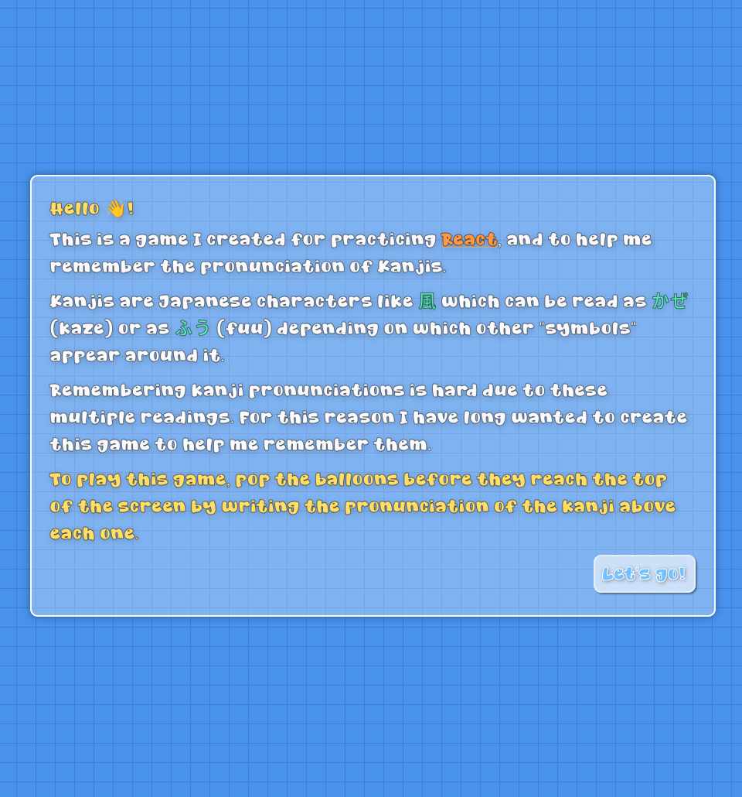
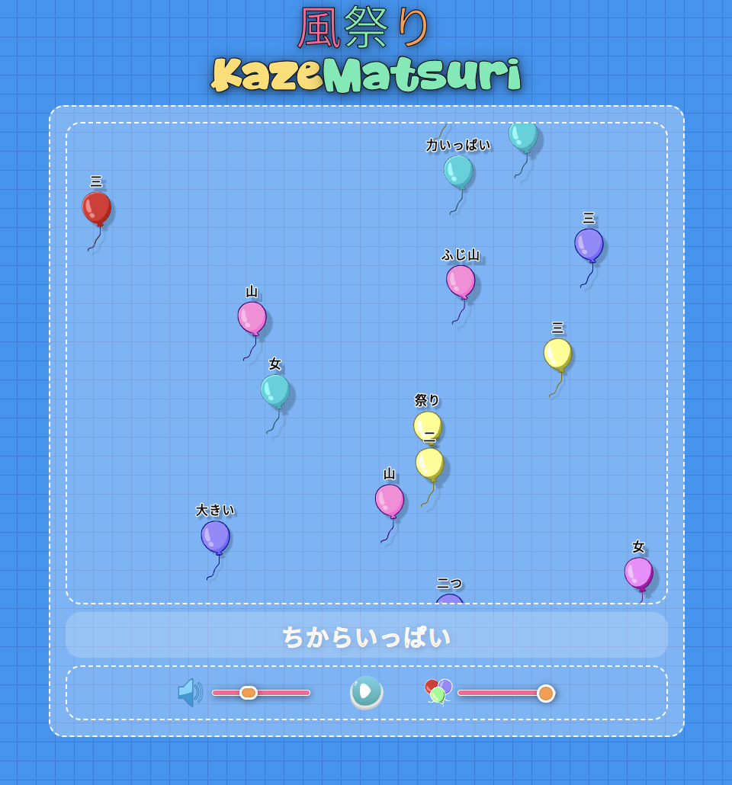

# KazeMatsuri

Wind Festival (風祭り) - A Kanji game I created for practicing React

> [!TIP]
> You can go [here](https://dwilches.github.io/KazeMatsuri/) to play this game from your browser. Still a work in progress.

This game is inspired by a computer game I played as a child which taught me how to type fast. 
The game had balloons with words inside and to pop them I had to quickly type the words written in them.

For my version of the game, the words inside the balloons are Kanjis (Japanese characters) and you have to
type their romanized On'yomi or Kun'yomi (i.e. their pronunciations) to pop them.

I'd wanted to make a game like this for some time, and now that I wanted to practice React, it was the perfect
opportunity.

> [!CAUTION]
> This is a work in progress, less than 2 days of work so it's very rough around the edges, 
> come back in some days!
> You may notice there are no word in the balloons yet for example, but the flying simulation and music are done.
> Still pending: popping sounds, improving SVGs and interaction elements.

## Intro Screen

## In Game UI

# TODO

To be completed in the next week:

- Credits
- Balloon popping effects/sounds
- Allow changing kanji levels
