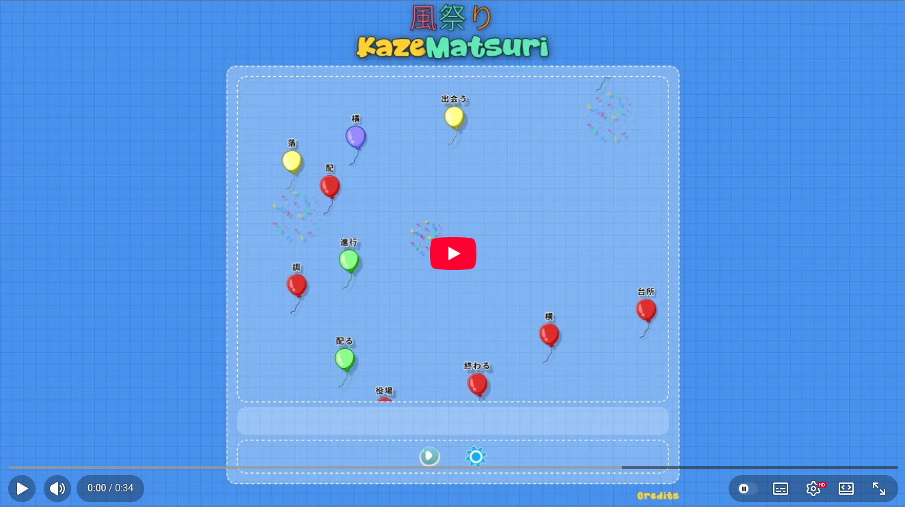

# KazeMatsuri

Wind Festival (風祭り) - A Kanji game I created for learning Japanese and practicing React

> [!TIP]
> You can go [here](https://dwilches.github.io/KazeMatsuri/) to play this game from your browser.

This game is inspired by a computer game I played as a child that taught me how to type quickly.
In that game, balloons containing words would float across the screen, and to pop them, I had to type the words as quickly as possible.

In my version of the game, the balloons contain Kanji (Japanese characters), and to pop them, you must type their 
romanized On'yomi or Kun'yomi reading (that is, one of their pronunciations).

I'd wanted to make a game like this for a while, and practicing React gave me the perfect opportunity to do it.

> [!NOTE]
> This game is designed for devices with physical keyboards (such as PCs, laptops, and some mobile devices).
>
> The gameplay is built around being able to watch the screen while typing, so it doesn't work
> well with virtual keyboards where you need to constantly switch between the game and the keyboard.
> As a result, the experience on most mobile devices is less enjoyable.
>
> If the game detects that you're using a mobile device, it will display a warning.
> You can still continue if your device has a physical keyboard, such as certain tablets.
